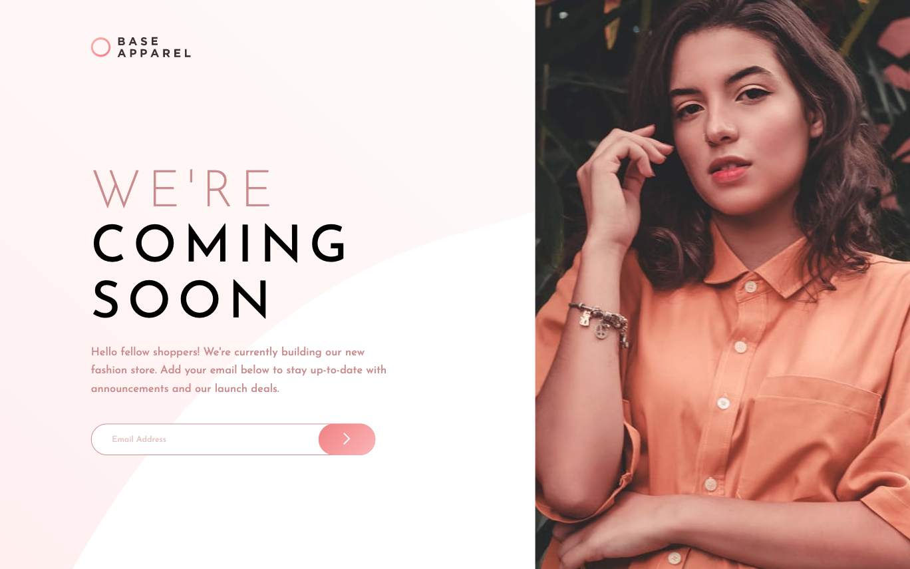

# Frontend Mentor - Base Apparel coming soon page solution

This is a solution to the [Base Apparel coming soon page challenge on Frontend Mentor](https://www.frontendmentor.io/challenges/base-apparel-coming-soon-page-5d46b47f8db8a7063f9331a0). Frontend Mentor challenges help you improve your coding skills by building realistic projects. 

## Table of contents

- [Overview](#overview)
  - [The challenge](#the-challenge)
  - [Screenshot](#screenshot)
  - [Links](#links)
- [My process](#my-process)
  - [Built with](#built-with)
  - [What I learned](#what-i-learned)
  - [Continued development](#continued-development)
- [Author](#author)

**Note: Delete this note and update the table of contents based on what sections you keep.**

## Overview

### The challenge

Users should be able to:

- View the optimal layout for the site depending on their device's screen size
- See hover states for all interactive elements on the page
- Receive an error message when the `form` is submitted if:
  - The `input` field is empty
  - The email address is not formatted correctly

### Screenshot

### Links

- Solution URL: [https://github.com/kbrandon19/BaseApparel.git]
- Live Site URL: [Add live site URL here](https://your-live-site-url.com)

## My process

### Built with

- Semantic HTML5 markup
- CSS custom properties
- Flexbox
-Javascript (Email Validation, Error messages)
- Mobile-first workflow

### What I learned

I became more familiar and comfortable with Javascript using it to validate the email input from the user.

## Author

- Website - [Kenneth Brandon](https://www.your-site.com)
- Frontend Mentor - [@kbrandon19](https://www.frontendmentor.io/profile/kbrandon19)
- Twitter - [@mrdebonairfox](https://www.twitter.com/mrdebonairfox)
- Instgram - [@mrdebonairfox](https://www.instagram.com/mrdebonairfox)

**Note: Delete this note and add/remove/edit lines above based on what links you'd like to share.**

