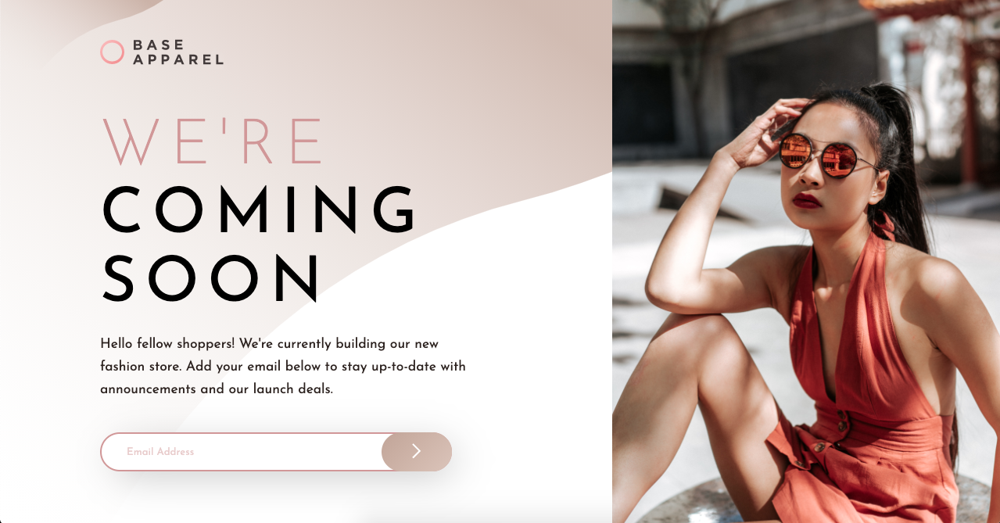

# Fashion Brand Landing Page
## Table of contents

- [Overview](#overview)
  - [The challenge](#the-challenge)
  - [Screenshot](#screenshot)
  - [Links](#links)
- [My process](#my-process)
  - [Built with](#built-with)
- [Author](#author)

## Overview

### The challenge

Users should be able to:

- View the optimal layout for the site depending on their device's screen size
- See hover states for all interactive elements on the page
- Receive an error message when the `form` is submitted if:
  - The `input` field is empty
  - The email address is not formatted correctly

### Screenshot

### Links

- Live Site URL: [https://kbrandon19.github.io/fashion-brand-landing-page/](https://kbrandon19.github.io/fashion-brand-landing-page/)

## My process

### Built with

- Semantic HTML5 markup
- CSS custom properties
- Flexbox
-Javascript (Email Validation, Error messages)
- Mobile-first workflow

## Author

- Website - [Kenneth Brandon](https://www.your-site.com)
- Frontend Mentor - [@kbrandon19](https://www.frontendmentor.io/profile/kbrandon19)
- Twitter - [@mrdebonairfox](https://www.twitter.com/mrdebonairfox)
- Instgram - [@mrdebonairfox](https://www.instagram.com/mrdebonairfox)

